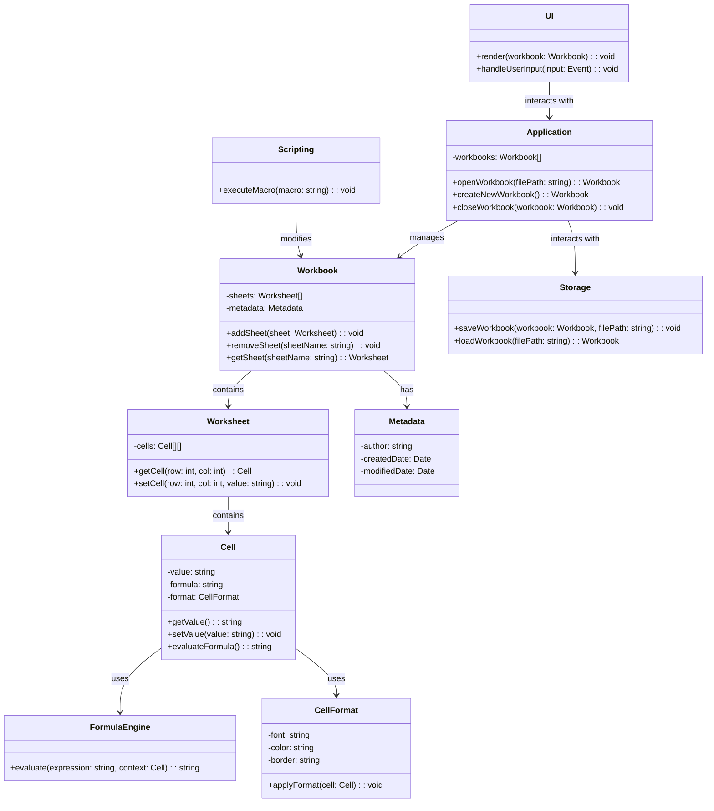

# XO

```mermaid
classDiagram
    %% Core Components
    class Application {
        -workbooks: Workbook[]
        +openWorkbook(filePath: string): Workbook
        +createNewWorkbook(): Workbook
        +closeWorkbook(workbook: Workbook): void
    }

    class Workbook {
        -sheets: Worksheet[]
        -metadata: Metadata
        +addSheet(sheet: Worksheet): void
        +removeSheet(sheetName: string): void
        +getSheet(sheetName: string): Worksheet
    }

    class Worksheet {
        -cells: Cell[][]
        +getCell(row: int, col: int): Cell
        +setCell(row: int, col: int, value: string): void
    }

    class Cell {
        -value: string
        -formula: string
        -format: CellFormat
        +getValue(): string
        +setValue(value: string): void
        +evaluateFormula(): string
    }

    class FormulaEngine {
        +evaluate(expression: string, context: Cell): string
    }

    class Metadata {
        -author: string
        -createdDate: Date
        -modifiedDate: Date
    }

    class CellFormat {
        -font: string
        -color: string
        -border: string
        +applyFormat(cell: Cell): void
    }

    class Storage {
        +saveWorkbook(workbook: Workbook, filePath: string): void
        +loadWorkbook(filePath: string): Workbook
    }

    class UI {
        +render(workbook: Workbook): void
        +handleUserInput(input: Event): void
    }

    class Scripting {
        +executeMacro(macro: string): void
    }

    %% Relationships
    Application --> Workbook : manages
    Workbook --> Worksheet : contains
    Worksheet --> Cell : contains
    Cell --> FormulaEngine : uses
    Workbook --> Metadata : has
    Cell --> CellFormat : uses
    Application --> Storage : interacts with
    UI --> Application : interacts with
    Scripting --> Workbook : modifies


```